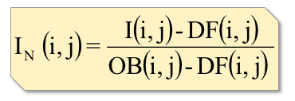

Abstract
--------

NeuNorm is an open-source Python library that normalized neutron imaging measurements. 

In order to cancel detector electronic noises, source beam fluctuations and other pollution signals from close by beam lines, every data acquired need to be normalized. In order to perform the normalization, one must take, in addition to his data set, either 1 or 2 extra data set. A set of open beam (OB) when sample has been removed but beam is on. An optional set of dark field (DF) is taken when beam is off and sample off. The dark field allows to clean the electronic noises from the images. The principle of normalization can be summarized by the following figure. 

which is defined by the following equation

where In is the image normalized, I the raw image, DF the dark field, OB the open beam and i and j the x and y-pixels along the images.

To improve the normalization, the program also allows the user to select a region of interest (ROI) in the sample images in order to match the background of the raw data with the background of the open beam. This is necessary for some beam lines where the fluctuations of the beam are too important to be neglected. The program calculates then, for each raw data, the average counts of this ROI divided by the average counts of the same ROI of the open beams, then apply this ratio to the normalized data. 

Input data often contains very hight counts coming from gamma rays. Those are also corrected by the program by doing a median filter around those "gamma" pixels. How those gamma pixels are determined. They are always the highest counts for the input file format.
